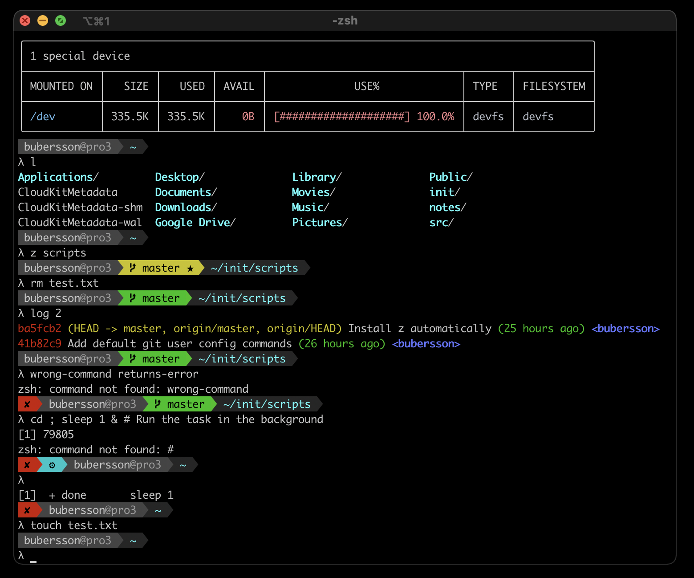

## My init scripts



Run following all-in-one
- install scripts 
- download / install zsh
- make zsh the default

```sh
sudo apt install curl
curl -sSL https://raw.githubusercontent.com/bubersson/init/master/install.sh | bash
```

```sh
cd ~

echo -e "Install pre-requisities: zsh and git"
if [[ "$(uname)" == "Darwin" ]]; then 
    brew install git zsh ; fi
if [[ "$(uname)" == "Linux" ]]; then 
    sudo apt install git zsh ; fi

git clone https://github.com/bubersson/init.git

sudo chsh -s $(which zsh)
touch .zshrc

# read -p "Enter the name of this device: " 
machine_name=box

echo -e "\n### Init all aliases, bindings, etc. ###" >> .zshrc
echo -e "# Available colors: https://i.imgur.com/okBgrw4.png" >> .zshrc
echo -e "export MY_MACHINE_NAME=${machine_name}" >> .zshrc
echo -e "export MY_PROMPT_CONTEXT_HOST=247" >> .zshrc
echo -e "export MY_PROMPT_CONTEXT_BG=238" >> .zshrc
echo -e "source ~/init/init.sh" >> .zshrc

cp -rf ~/init/dotfiles/.nanorc ~/.nanorc

zsh
```

Create files and folders
```sh
mkdir -p src
```

### Fix prompt font (when broken)
- iTerm: `Profiles > Text > Use built-in Powerline glyphs`.
- Linux: `sudo apt-get install fonts-powerline` (and then select some font that supports it like `Ubuntu Mono`)

Other resources
- https://raspberrypi.stackexchange.com/questions/34255/special-characters-show-as-question-marks-in-the-shell
- https://stackoverflow.com/questions/42271657/oh-my-zsh-showing-weird-character-on-terminal
- `sudo dpkg-reconfigure locales`

On linux install manually
```sh
cd ~/src
git clone https://github.com/powerline/fonts.git
cd fonts; .install.sh
```

### Set up git

Set default git user
```
git config --global user.name "FILL IN"
git config --global user.email FILL@IN.com
```

Setup .gitignore
```
touch ~/.gitignore
cat >> ~/.gitignore << ENDOFFILE
.obsidian/
.DS_Store
.DS_Store?
._*
.Spotlight-V100
.Trashes
ehthumbs.db
Thumbs.db

ENDOFFILE
git config --global core.excludesFile ~/.gitignore
```

Make sure `git log` shows inline and does not clear the terminal
```sh
git config --global --replace-all core.pager "less -iXFR"
```

Set up automatic updates of `apt`:
https://www.cyberciti.biz/faq/how-to-set-up-automatic-updates-for-ubuntu-linux-18-04/

### Mac Only

Install Homebrew.
Go to https://brew.sh/ and run command from there. 
```sh
brew analytics off # disable tracking 
up # works if above scripts are properly installed
brew install mc curl htop z gnupg # cli
brew install golang deno # extended cli
brew install --cask vlc brave-browser veracrypt obsidian calibre # apps
```

Make brew update automatically
```sh
brew tap domt4/autoupdate
brew autoupdate --start 43200 # update every 12 hours
```

Show brew apps dependency tree
```sh
brew deps --tree --installed
```

Make the MacOS dock autohide fast.
```sh
defaults write com.apple.dock autohide-delay -float 0
defaults write com.apple.dock autohide-time-modifier -float 0.25
killall Dock
```

Fix Home and End behavior on MacOS (so it doesn't scroll to the top and bottom of the page)
* https://apple.stackexchange.com/questions/18016/can-i-change-the-behavior-of-the-home-and-end-keys-on-an-apple-keyboard-with-num

Disable scaling for mouse.
```sh
defaults write -g com.apple.mouse.scaling -1
```

Transfer iterm2 preferences. First get old preferences from `~/.config/iterm2` (or whatever configured folder), then move those to new laptop:
```
cd .config ; mkdir iterm2
```
In iterm2 go to `Preferences > General > Preferences` and enable both loading and saving from the folder (may need to copypaste the hidden path).

The preferences include making ⌘+left, ⌘+right work, also can be found here:
* https://coderwall.com/p/dapstw/keybindings-for-macosx-users-on-iterm2
* https://unix.stackexchange.com/questions/300091/use-mac-os-command-key-in-bashs-bind-command


### Linux Only
```sh
sudo apt-get install htop mc fonts-powerline
```

Install Flatpak apps
```sh
flatpak install flathub \
org.gimp.GIMP \
com.bitwarden.desktop \
com.brave.Browser \
com.calibre_ebook.calibre \
com.visualstudio.code \
md.obsidian.Obsidian \
me.kozec.syncthingtk \
org.qbittorrent.qBittorrent \
org.signal.Signal \
com.github.tchx84.Flatseal
```

Disable sounds
```sh
sudo mv /usr/share/sounds/freedesktop/stereo/audio-volume-change.oga{,.backup}
sudo mv /usr/share/sounds/elementary/stereo/audio-volume-change.wav{,.backup}
```

Make `code` work when VSCode is install via flatpak.
Add to .zshrc
```sh
alias code="flatpak run com.visualstudio.code"
```

#### Keyboard Shortcuts
- First install the hopkeyboard
- Then apply this

```sh
dconf write /org/gnome/desktop/wm/keybindings/switch-applications "['<Super>Tab', '<Primary>Tab']"
dconf write /org/gnome/desktop/wm/keybindings/switch-applications-backward "['<Shift><Super>Tab', '<Primary><Shift>Tab']"
dconf write /org/gnome/desktop/wm/keybindings/switch-group "['<Super>grave', '<Super>asciitilde', '<Primary>grave']"
dconf write /org/gnome/desktop/wm/keybindings/switch-group-backward  "['<Shift><Super>grave', '<Shift><Super>asciitilde', '<Primary><Shift>grave']"
dconf write /org/gnome/desktop/wm/keybindings/toggle-maximized "['<Super>m', '<Super>Up']"
dconf write /org/gnome/desktop/wm/keybindings/switch-to-workspace-down "['<Alt>Page_Down']"
dconf write /org/gnome/desktop/wm/keybindings/switch-to-workspace-up "['<Alt>Page_Up']"
dconf write /org/gnome/desktop/wm/keybindings/switch-to-workspace-left "['<Super>Home']"
dconf write /org/gnome/desktop/wm/keybindings/switch-to-workspace-right "['<Super>End']"
dconf write /org/gnome/mutter/keybindings/toggle-tiled-left "['<Primary><Super>Left', '<Primary><Super>KP_Left', '<Primary><Super>h', '<Super>Left']"
dconf write /org/gnome/mutter/keybindings/toggle-tiled-right "['<Primary><Super>Right', '<Primary><Super>KP_Right', '<Primary><Super>l', '<Super>Right']"
```

#### VSCode Key Bindings
##### Linux (Flatpak)
Flatpak Path: `~/.var/app/com.visualstudio.code/config/Code/User/keybindings.json`

Installation: Copy from init into the right spot. 
`cp ~/init/configs/vscode/keybindings.json ~/.var/app/com.visualstudio.code/config/Code/User/keybindings.json`

Updating init: Copy current keybindings into init. 
`cp ~/.var/app/com.visualstudio.code/config/Code/User/keybindings.json ~/init/configs/vscode/keybindings.json`

##### MacOS
Mac Path: `"~/Library/Application Support/Code/User"`
Install:
`cp ~/init/configs/vscode/keybindings-mac.json ~/Library/Application\ Support/Code/User/keybindings.json`
Move current keybindings into init folder.
`cp ~/Library/Application\ Support/Code/User/keybindings.json ~/init/configs/vscode/keybindings-mac.json`

#### Elementary OS

Make terminal have black background.
```sh
dconf write /io/elementary/terminal/settings/foreground "'#ddd'"
dconf write /io/elementary/terminal/settings/background "'#000'"
```
Move plank app bar to the left and make it work fast
```sh
dconf write /net/launchpad/plank/docks/dock1/hide-delay "200"
dconf write /net/launchpad/plank/docks/dock1/icon-size "48"
dconf write /net/launchpad/plank/docks/dock1/position "'left'"
dconf write /net/launchpad/plank/docks/dock1/theme "'Matte'"
dconf write /net/launchpad/plank/docks/dock1/unhide-delay "0"
```

Change theme for darker (e.g. for doublecmd)

Download dark theme, e.g. https://www.gnome-look.org/p/1302313
Unpack it and copy gtk-2.0 folder to 
`/usr/share/themes/io.elementary.stylesheet.blueberry/`

**Switch to deep sleep.**
Descriptions: https://learnubuntumate.weebly.com/draining-battery.html
Update `/sys/power/mem_sleep` to include deep sleep
```sh
code /etc/default/grub
# and there 
GRUB_CMDLINE_LINUX_DEFAULT="quiet splash mem_sleep_default=deep"
```
and then confirm (in brackets is the selected one)
```sh
λ cat /sys/power/mem_sleep
s2idle [deep]
```

## Updating

Just run 
```sh
cd ~/init ; git pull
```

## Other ideas / tricks
* https://darrenburns.net/posts/tools/
