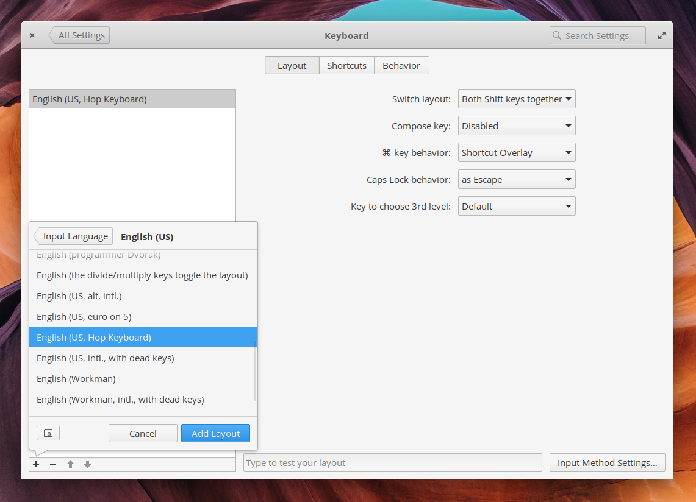

# Custom XKB Keyboard

Modified XKB keyboard that provides ~MacOS experience on Linux laptop.
See the definition in `hopkeyboard` and comment out changes you don't like. 

NOTE: If you 
 - need just a small change or 
 - are not fiddling with Ctrl or
 - you need the key change just for your Terminal  
then you can try using `xmodmap`, but note the chances are that 
your system will be trying to overwrite it anyway with xkbmap. See some tutorials on the bottom. 

## Set up
Download the `hopkeyboard` file somewhere to your system as `hopkeyboard`. 
```
cd [wherever you downloaded the file]
sudo ln -s hopkeyboard /usr/share/X11/xkb/symbols/hopkeyboard
```

## Test it
```
setxkbmap hopkeyboard
```

## Install it forever

Update `/usr/share/X11/xkb/rule/evdev.xml` and add following (e.g. under the english tree next below another `</variant>`).
```xml
<variant>
    <configItem>
        <name>hopkeyboard</name>
        <description>English (US, Hop - Mac friendly touches)</description>
    </configItem>
</variant>
```

Now you can select it as a keyboard layout in the GNOME UI.



Optionally update
```
/etc/default/keyboard
```
to say
```
XKBLAYOUT=hopkeyboard
```
Which should set it as a default (even more? not sure, send me PR to update this).

## Other tutorials
Tutorials:
 - https://askubuntu.com/questions/510024/what-are-the-steps-needed-to-create-new-keyboard-layout-on-ubuntu
 - https://unix.stackexchange.com/questions/202883/create-xkb-configuration-from-xmodmap
 - https://www.charvolant.org/doug/xkb/html/node5.html
 - https://www.x.org/releases/X11R7.6/doc/xorg-docs/input/XKB-Config.html
 - https://medium.com/@damko/a-simple-humble-but-comprehensive-guide-to-xkb-for-linux-6f1ad5e13450

Examples:
 - https://github.com/nakal/xmonad-conf/blob/f25e81bf16d212b35dfe69765a135787c09c4b7b/xkb/us_alt
 - https://unix.stackexchange.com/questions/205226/xkb-make-ctrlbackspace-behave-as-delete
